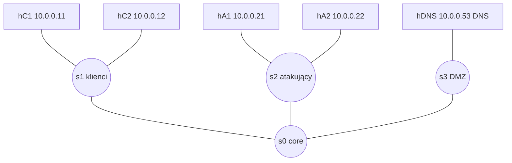

# SSP


```mermaid
graph TD

    %% Przełączniki
    s0((s0 core))
    s1((s1 klienci))
    s2((s2 atakujący))
    s3((s3 DMZ))

    %% Hosty klienci
    hC1[hC1 10.0.0.11]
    hC2[hC2 10.0.0.12]

    %% Hosty atakujący
    hA1[hA1 10.0.0.21]
    hA2[hA2 10.0.0.22]

    %% Hosty DMZ
    hDNS[hDNS 10.0.0.53 DNS]

    %% Połączenia hostów z przełącznikami
    hC1 --- s1
    hC2 --- s1

    hA1 --- s2
    hA2 --- s2

    hDNS --- s3

    %% Połączenia między przełącznikami (core)
    s1 --- s0
    s2 --- s0
    s3 --- s0
```
```
```
