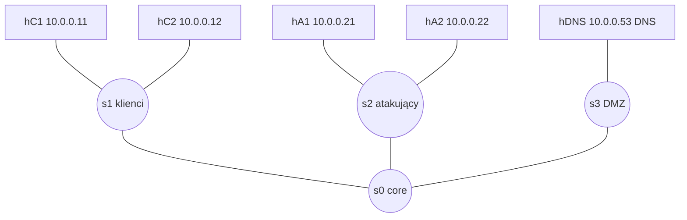

# SSP


```
```
DNS Flooding Detection in SDN (Floodlight + Mininet)
===================================================

This project demonstrates a DNS flooding detection algorithm implemented
as a Floodlight controller module and evaluated in a Mininet-based SDN testbed.

The goal is to show how DNS traffic volume and entropy can be monitored
to detect abnormal behavior such as DNS flooding attacks.


Project Structure
-----------------
- dnsdetect/
  - ```DNSFloodingDetector.java```     Floodlight module (detection logic)
- ```dns_ddos_topo.py```               Mininet topology and traffic generator
- ```attack_volume.sh```               DNS flood attack script (volume-based)
- ```attack_entropy.sh```              DNS flood attack script (entropy-based)
- ```stop_attacks.sh```                Script to stop all attack traffic
- ```README.txt / README.md```         Project documentation


Requirements
------------
System:
- Ubuntu 14.04 / 16.04 (recommended for Floodlight compatibility)

Software:
- Java 7 or 8
- Python 2.7
- Mininet
- Open vSwitch
- Floodlight Controller
- dig (dnsutils package)


Installation
------------
1. Install system dependencies:
   sudo apt update
   sudo apt install -y git openjdk-7-jdk python python-pip \
                       mininet openvswitch-switch \
                       dnsutils dnsmasq

2. Clone Floodlight:
   git clone https://github.com/floodlight/floodlight.git
   cd floodlight
   ant

3. Copy DNSFloodingDetector.java into:
   floodlight/src/main/java/net/floodlightcontroller/dnsdetect/

4. Register the module in:
   floodlight/src/main/resources/floodlightdefault.properties

5. Rebuild Floodlight:
   ant


Running the Experiment
----------------------
1. Start Floodlight:
   cd floodlight
   java -jar target/floodlight.jar

2. Start Mininet topology:
   sudo python dns_ddos_topo.py --controller-ip 127.0.0.1 --controller-port 6653

3. Basic DNS traffic starts automatically.
   Observe logs in Floodlight console:
   DNS WINDOW | domain=example.com volume=X pkt/s entropy=Y


Attack Scenarios
----------------
Volume-based DNS Flood:
- Generates a large number of DNS queries to the same domain.
- Run:
  bash attack_volume.sh <workers>

Entropy-based DNS Flood:
- Generates random subdomains to increase entropy.
- Run:
  bash attack_entropy.sh <workers>

Stop all attacks:
- Run:
  bash stop_attacks.sh


Detection Logic
---------------
The detector works in fixed time windows (1 second by default):

- Volume: number of DNS queries per domain per window
- Entropy: Shannon entropy of queried subdomains

A DNS flood is detected when:
- Volume increases significantly compared to historical baseline, or
- Entropy increases significantly compared to historical baseline

Both metrics are calculated using a sliding window history.


Logs
----
Normal traffic:
DNS WINDOW | domain=example.com volume=4 pkt/s entropy=0.8

Detected attack:
DNS FLOOD DETECTED | domain=example.com volume=24 pkt/s entropy=0.65


Notes
-----
- Entropy may be 0 when all queries target the same subdomain.
- Legitimate traffic is intentionally low and stable.
- Attack traffic is generated externally to allow clear traffic spikes.
- Parameters such as window size, history length, and thresholds
  can be adjusted in DNSFloodingDetector.java.
