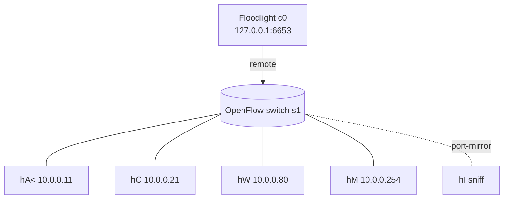

# SSP

```mermaid
graph TD
  %% Controller & switch
  c0[Floodlight c0<br/>127.0.0.1:6653]
  s1[(OpenFlow switch s1)]

  c0 -- remote --> s1

  %% Hosts
  hA[hA< 10.0.0.11]
  hC[hC 10.0.0.21]
  hW[hW 10.0.0.80]
  hM[hM 10.0.0.254]
  hI[hI sniff]

  %% Links
  s1 --- hA
  s1 --- hC
  s1 --- hW
  s1 --- hM
  s1 -. port-mirror .- hI
```
